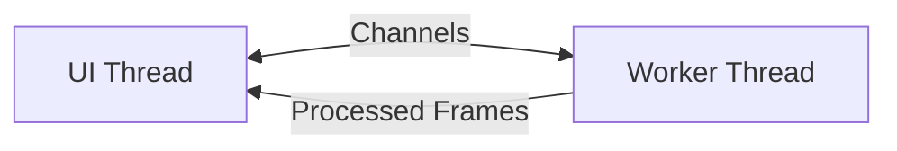

# ⚡ Spix

Spix, short for SpixelaTUIr *(pronounced "speex-eh-lah-tweer")*.


**Unleash your inner glitch artist directly in your terminal!** 🎨✨

Spix is a high-performance, terminal-based image glitching and processing powerhouse. Built with Rust for maximum speed, it lets you craft stunning digital hallucinations through a real-time, interactive TUI. 

Whether you're looking to create retro CRT aesthetics, mind-bending pixel sorts, or smooth parameter-swept animations, Spix puts the power of creative destruction right at your fingertips.

---

## 🔥 Why Spix?

- **🚀 Blazing Fast Live Preview:** Witness your changes in real-time! Leveraging the Sixel graphics protocol, Spix renders high-fidelity previews directly in your terminal.
- **🛠️ Powerful Effect Stacking:** Build complex, multi-layered visual pipelines. Mix and match color manipulation, spatial glitches, and retro overlays to find your perfect aesthetic.
- **✨ Instant Inspiration:** Hit `r` to randomize your entire pipeline and discover unexpected visual magic.
- **🎞️ Animation Engine:** Go beyond static images! Capture frames or use the **Automatic Parameter Sweep** to generate hypnotic GIFs and WebP animations.
- **🎨 Custom UI Themes:** Essential for **Linux Ricers**! Fully customize the application's color palette via `~/.config/spix/theme.json` to seamlessly integrate with your meticulously crafted Catppuccin, Nord, or Gruvbox desktop environments.
- **⌨️ Keyboard-Centric Workflow:** Designed for speed. Everything is a keypress away—no mouse required.
- **🧩 TWM Ready:** **Looks and feels incredible in Tiling Window Managers!** Whether you use `i3`, `sway`, `hyprland`, or `tmux`, Spix's responsive layout and keyboard-driven interface make it the ultimate aesthetic companion for your terminal setup.


---

## 🚀 Installation

### 1. Pre-built Binaries (Preferred)
The easiest way to get started! Download the latest executable for your platform from our **[Releases Page](https://github.com/gioleppe/SpixelaTUIr/releases)**. 

> **Note:** Ensure you are using a [Sixel-compatible](https://rioterm.com/docs/features/sixel-protocol) terminal emulator like **Ghostty**, **Windows Terminal**, **WezTerm**, or **Foot**.

### 2. Install via Cargo
If you have the Rust toolchain installed, you can build and install directly:

```bash
cargo install --path .
```

---

## 🗂️ Batch Processing (CLI)

Apply any saved pipeline to an entire folder of images **without opening the TUI**:

```bash
spixelatuir --batch "photos/*.jpg" --pipeline my_pipeline.json --outdir processed/
```

| Flag | Description |
|------|-------------|
| `--batch <glob>` | Glob pattern that selects the input images (quote it to prevent shell expansion) |
| `--pipeline <file>` | Path to a JSON or YAML pipeline file saved from the TUI (`Ctrl+S`) |
| `--outdir <dir>` | Output directory (created automatically if it does not exist) |

**Output format** is inferred from the source file's extension (`.jpg` → JPEG at quality 90, `.webp` → WebP, `.bmp` → BMP, everything else → PNG).  If an output file already exists from a previous run, the filename is auto-incremented (`image_1.png`, `image_2.png`, …) to avoid overwriting it.

### Example

```bash
# Save a pipeline in the TUI with Ctrl+S, then process a whole folder:
spixelatuir --batch "raw_photos/**/*.png" --pipeline cyberpunk.json --outdir glitched/
```

---

## 🎨 Effects Catalog

| Category | Effect | Key Parameters | Description |
|----------|--------|---------------|-------------|
| **Color** | `Invert` | — | Invert all pixel colors. |
| **Color** | `GradientMap` | `preset` | Map luminance to a color gradient (several presets + custom). |
| **Color** | `HueShift` | `degrees` | Rotate the hue wheel by any angle (0–360°). |
| **Color** | `Contrast` | `factor` | Multiply contrast (1.0 = identity). |
| **Color** | `Saturation` | `factor` | Scale saturation (0 = greyscale, 1.0 = identity). |
| **Color** | `ColorQuantization` | `levels` | Posterize: reduce each channel to N discrete levels. |
| **Glitch** | `Pixelate` | `block_size` | Mosaic-style pixelation. |
| **Glitch** | `RowJitter` | `magnitude`, `seed` | Random horizontal row shifting. Deterministic with `seed`. |
| **Glitch** | `BlockShift` | `shift_x`, `shift_y` | Shift a rectangular block of pixels. |
| **Glitch** | `PixelSort` | `threshold`, `reverse` | Sort pixel runs by luminance. `reverse` flips sort order. |
| **Glitch** | `FractalJulia` | `scale`, `cx`, `cy`, `max_iter`, `blend` | Overlay a Julia set fractal blended with the source image. |
| **Glitch** | `DelaunayTriangulation` | `num_points`, `seed` | Low-poly mosaic via Bowyer-Watson triangulation of random sample points. |
| **Glitch** | `GhostDisplace` | `copies`, `offset_x`, `offset_y`, `hue_sweep`, `opacity` | Create N displaced/echoed copies with progressive hue sweep. |
| **CRT** | `Scanlines` | `spacing`, `opacity`, `color_r/g/b` | Horizontal scanline overlay with optional color tint. |
| **CRT** | `Noise` | `intensity`, `monochromatic`, `seed` | RGB or mono noise overlay. Deterministic with `seed`. |
| **CRT** | `Vignette` | `radius`, `softness` | Darken the image edges for a vintage look. |
| **Composite** | `CropRect` | `x`, `y`, `width`, `height` | Crop to a rectangular region. |

---

  

## ⌨️ Master the Shortcuts

| Key | Action |
|-----|--------|
| `o` | **Open** an image |
| `a` | **Add** an effect to the stack |
| `r` | **Randomize** everything! |
| `Enter` | **Edit** parameters of the selected effect |
| `Space` | **Toggle** effect on/off or **Play** animation |
| `d` / `Delete` | **Delete** the selected effect |
| `Shift+K` / `Shift+J` | **Reorder** — move effect up / down |
| `v` | **Split View** (Before vs. After) |
| `e` | **Export** current frame |
| `Ctrl+Z` / `Ctrl+Y` | **Undo / Redo** pipeline edits |
| `Ctrl+N` | Open **Animation Panel** |
| `Ctrl+S` / `L`| **Save / Load** your pipeline preset |
| `[` / `]` | Decrease / increase preview resolution |
| `h` | Show full **Help** overlay |
| `q` | Quit (with unsaved changes protection) |

> **Circular navigation:** All menus and lists wrap around — pressing Up at the first item jumps to the last, and Down at the last jumps to the first.

---

## 🏗️ Architecture

Spix is built for responsiveness. It uses a **multi-threaded architecture** where the UI remains buttery smooth while a dedicated worker thread handles the heavy image processing math.

- **Main Thread:** Handles input, state management, and Sixel rendering.
- **Worker Thread:** Executes the effect pipeline and exports high-res assets.



---

## 🤝 Contributing & Community

Spix is an open-source labor of love. We cherish every contribution! 
- Found a bug? Open an **Issue**.
- Want a new effect? Send a **Pull Request**.
- Just want to chat? Visit **[gioleppe.github.io](https://gioleppe.github.io/)**.

---

## ⚠️ Disclaimer & License

*Spix is a GenAI-driven project built to explore agent-handling skills and creative coding. Don't take it too seriously—just have fun glitching!*

Licensed under the [MIT License](LICENSE).