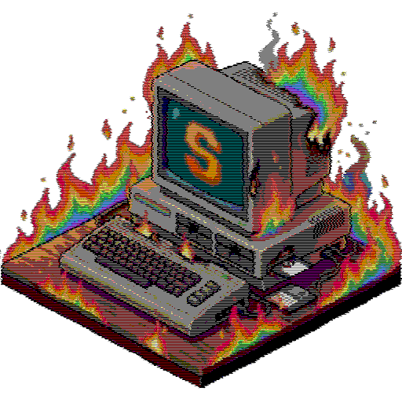
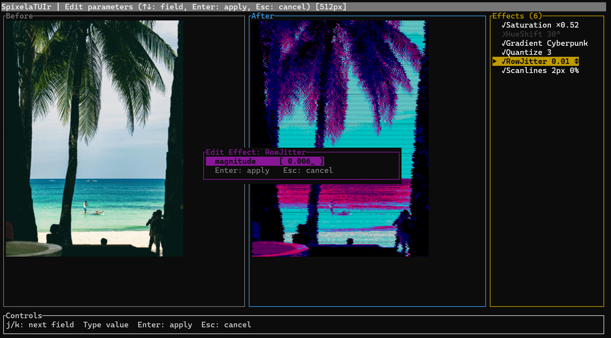
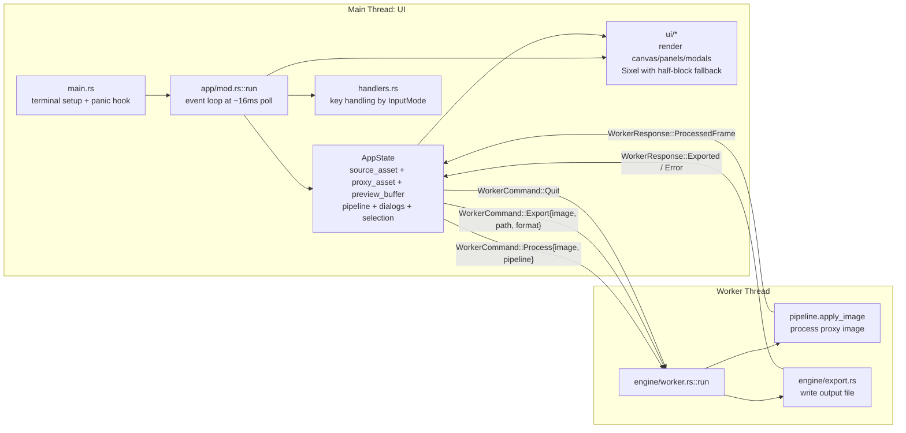

# SpixelaTUIr




A terminal-based image glitching and processing tool written in Rust.

## What is this thing?

SpixelaTUIr is a terminal-based image glitching and processing application designed for creative tinkering and fast visual experimentation. Built in Rust, it leverages the Sixel graphics protocol to render high-fidelity, live previews of image manipulations entirely inside your terminal emulator.

With SpixelaTUIr, you can intuitively construct and compose complex, multi-layered visual effect pipelines. Combine color manipulation, stylistic retro CRT overlays, and pixel-level structural glitches like pixel sorting, row jittering, and block shifting. It lets you interactively tweak effect parameters, instantly randomize pipelines for unexpected inspiration, and seamlessly visualize your changes in real-time. 





Once you've crafted the perfect aesthetic, you can export the full-resolution glitch art to your filesystem or save your custom effect pipeline as a preset to apply to other images.

## Features

- **Live preview canvas** — renders processed images directly in the terminal using the Sixel graphics protocol (with ANSI half-block fallback for terminals that don't support Sixel); the status bar always shows the active proxy resolution (e.g. `[512px]`)
- **Interactive effects pipeline** — build a chain of effects that are applied in real-time to a downscaled proxy of your image; the Effects panel title always shows the current effect count (e.g. `Effects (3)`)
- **Multi-threaded** — image processing runs on a dedicated worker thread, keeping the UI responsive. Re-rendering is only triggered when needed. Per-pixel loops are auto-vectorised by the compiler
PNG, JPEG, GIF, BMP
- **Pipeline randomisation** — instantly randomise all effect parameters with a single keypress
- **Pipeline save / load** — export your favourite pipeline to a JSON file and re-import it in any future session
- **Undo / redo** — up to 20 levels of pipeline undo (`Ctrl+Z`) and redo (`Ctrl+Y`)
- **Unsaved-changes guard** — a prominent centered confirmation modal prevents accidentally quitting with an unsaved pipeline
- **Per-effect enable/disable** — toggle individual effects on/off with `Space` in the Effects panel without removing them, for quick A/B comparisons; disabled effects are shown in grey with a `✗` indicator
- **Side-by-side split view** — press `v` to divide the canvas horizontally, showing the original (before) on the left and the processed preview (after) on the right
- **Live histogram overlay** — press `H` to display a compact luminance histogram in the top-right corner of the canvas, computed from the current preview buffer with no extra processing thread

## Installation

### Pre-built binaries


### Installing from source
#### Prerequisites

Before installing SpixelaTUIr, ensure you have the following dependencies installed:

- **Rust (stable)**: Install from [rustup.rs](https://rustup.rs/)

#### Installing with Cargo

To install SpixelaTUIr locally using Cargo, navigate to the project directory and run:

```bash
cargo install --path .
```

This will build the project in release mode and install the `spixelatuir` binary to `~/.cargo/bin`, making it available in your PATH.

## Effects

| Category | Effect | Description |
|----------|--------|-------------|
| **Color** | `HueShift` | Rotate the colour spectrum by N degrees (HSL) |
| | `GradientMap` | Remaps luminance to a custom colour gradient (Synthwave, Sepia, Cyberpunk, Night Vision, or Custom) |
| | `Saturation` | Scale colour intensity (HSL) |
| | `Contrast` | Expand or compress the tonal range |
| | `Invert` | Mathematical RGB inversion |
| | `ColorQuantization` | Posterize to N palette levels |
| **Glitch** | `Pixelate` | Block-average downsampling then nearest-neighbour upscale |
| | `RowJitter` | Deterministic horizontal row displacement |
| | `PixelSort` | Sort above-threshold pixels by luminance within each row |
| | `BlockShift` | Translate the entire image by (x, y) with wrapping |
| **CRT** | `Scanlines` | Semi-transparent dark horizontal lines |
| | `Noise` | Per-pixel RGB or monochromatic noise |
| | `Vignette` | Smooth-step radial edge darkening |
| **Composite** | `CropRect` | Crop to a given rectangle |

## Keyboard Shortcuts

| Key | Action |
|-----|--------|
| `o` | Open an image (file browser) |
| `Tab` | Toggle keyboard focus between Canvas and Effects panel |
| `↑` / `k` | Navigate effect list up (requires Effects panel focus) |
| `↓` / `j` | Navigate effect list down (requires Effects panel focus) |
| `a` | Add an effect from the preset menu (requires Effects panel focus) |
| `d` / `Delete` | Delete the selected effect and re-process (requires Effects panel focus) |
| `Enter` | Edit parameters of the selected effect (requires Effects panel focus). For effects with presets (like `GradientMap`), use `←` / `→` (Left/Right) to cycle between them. |
| `Space` | Toggle the selected effect on/off (requires Effects panel focus); disabled effects are skipped during rendering but stay in the pipeline |
| `K` / `Shift+↑` | Move selected effect one position up in the pipeline (cyan highlight while dragging) |
| `J` / `Shift+↓` | Move selected effect one position down in the pipeline (cyan highlight while dragging) |
| `r` | Randomise all effect parameter values |
| `e` | Export the current preview as an image (dialog with directory/filename/format) |
| `[` | Decrease preview resolution tier (1024 → 768 → 512 → 256 px) |
| `]` | Increase preview resolution tier (256 → 512 → 768 → 1024 px) |
| `v` | Toggle side-by-side before/after split view (left = original, right = processed) |
| `H` | Toggle live luminance histogram overlay in the top-right corner of the canvas |
| `Ctrl+S` | Save the current pipeline via a dialog (always writes JSON) |
| `Ctrl+L` | Load / import a pipeline from a JSON or YAML file (file browser) |
| `Ctrl+D` | Clear all effects at once (shows a confirmation prompt) |
| `Ctrl+Z` | Undo the last pipeline change (up to 20 levels) |
| `Ctrl+Y` | Redo the last undone pipeline change |
| `h` | Open the full keyboard-shortcut help overlay |
| `q` / `Esc` | Quit (shows a confirmation modal if there are unsaved pipeline changes: `y`/Enter to quit, `n`/Esc to cancel, `s` to save pipeline) |

## Building

Requires Rust (stable):

```bash
cargo build --release
cargo run --release
```

## Architecture

SpixelaTUIr uses a two-thread architecture:

- **Main/UI thread**: terminal lifecycle, event loop, input handling, app state, and rendering (`ratatui` + `ratatui-image`).
- **Worker thread**: CPU-heavy image processing and export operations.

The UI and worker communicate through `std::sync::mpsc` channels using typed messages:

- **UI → Worker**: `WorkerCommand::{Process, Export, Quit}`
- **Worker → UI**: `WorkerResponse::{ProcessedFrame, Exported, Error}`



Module ownership:

- `src/main.rs` — terminal setup/restore, panic hook, starts app run loop
- `src/app/mod.rs` — event loop, worker channel wiring, redraw scheduling
- `src/app/state.rs` — central `AppState`, image loading, proxy reload, dispatch to worker, undo/redo
- `src/app/handlers.rs` — keyboard behavior for all modes
- `src/ui/` — pure rendering/layout/widgets (no heavy image math)
- `src/engine/worker.rs` — command handling, stale process draining, process/export dispatch
- `src/engine/export.rs` — format-specific export path
- `src/effects/` — effect math and pipeline execution
- `src/config/` — pipeline load/save (JSON/YAML)

## Image Formats

Supported via the [`image`](https://github.com/image-rs/image) crate: **PNG, JPEG, GIF, BMP**.

## License

See [LICENSE](LICENSE).
