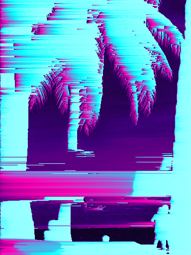
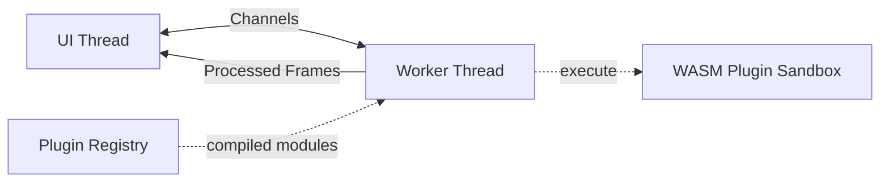

# ⚡ Spix

Spix, short for SpixelaTUIr *(pronounced "speex-eh-lah-tweer")*.


**Unleash your inner glitch artist directly in your terminal!** 🎨✨

Spix is a high-performance, terminal-based image glitching and processing powerhouse. Built with Rust for maximum speed, it lets you craft stunning digital hallucinations through a real-time, interactive TUI. 

Whether you're looking to create retro CRT aesthetics, mind-bending pixel sorts, or smooth parameter-swept animations, Spix puts the power of creative destruction right at your fingertips.

---

## 🔥 Why Spix?

- **🚀 Blazing Fast Live Preview:** Witness your changes in real-time! Leveraging the Sixel graphics protocol, Spix renders high-fidelity previews directly in your terminal.
- **🛠️ Powerful Effect Stacking:** Build complex, multi-layered visual pipelines. Mix and match color manipulation, spatial glitches, and retro overlays to find your perfect aesthetic.
- **✨ Instant Inspiration:** Hit `r` to randomize your entire pipeline and discover unexpected visual magic.
- **🎞️ Animation Engine:** Go beyond static images! Capture frames or use the **Automatic Parameter Sweep** to generate hypnotic GIFs and WebP animations.
- **🎨 Custom UI Themes:** Essential for **Linux Ricers**! Fully customize the application's color palette via `~/.config/spix/theme.json` to seamlessly integrate with your meticulously crafted Catppuccin, Nord, or Gruvbox desktop environments.
- **⌨️ Keyboard-Centric Workflow:** Designed for speed. Everything is a keypress away—no mouse required.
- **🧩 TWM Ready:** **Looks and feels incredible in Tiling Window Managers!** Whether you use `i3`, `sway`, `hyprland`, or `tmux`, Spix's responsive layout and keyboard-driven interface make it the ultimate aesthetic companion for your terminal setup.


---

## 🚀 Installation

### 1. Pre-built Binaries (Preferred)
The easiest way to get started! Download the latest executable for your platform from our **[Releases Page](https://github.com/gioleppe/SpixelaTUIr/releases)**. 

> **Note:** Ensure you are using a [Sixel-compatible](https://rioterm.com/docs/features/sixel-protocol) terminal emulator like **Ghostty**, **Windows Terminal**, **WezTerm**, or **Foot**.

### 2. Install via Cargo
If you have the Rust toolchain installed, you can build and install directly:

```bash
cargo install --path .
```

---

## 🗂️ Batch Processing (CLI)

Apply any saved pipeline to an entire folder of images **without opening the TUI**:

```bash
spixelatuir --batch "photos/*.jpg" --pipeline my_pipeline.json --outdir processed/
```

| Flag | Description |
|------|-------------|
| `--batch <glob>` | Glob pattern that selects the input images (quote it to prevent shell expansion) |
| `--pipeline <file>` | Path to a JSON or YAML pipeline file saved from the TUI (`Ctrl+S`) |
| `--outdir <dir>` | Output directory (created automatically if it does not exist) |

**Output format** is inferred from the source file's extension (`.jpg` → JPEG at quality 90, `.webp` → WebP, `.bmp` → BMP, everything else → PNG).  If an output file already exists from a previous run, the filename is auto-incremented (`image_1.png`, `image_2.png`, …) to avoid overwriting it.

### Example

```bash
# Save a pipeline in the TUI with Ctrl+S, then process a whole folder:
spixelatuir --batch "raw_photos/**/*.png" --pipeline cyberpunk.json --outdir glitched/
```

---

## 🎨 Effects Catalog

| Category | Effect | Key Parameters | Description |
|----------|--------|---------------|-------------|
| **Color** | `Invert` | — | Invert all pixel colors. |
| **Color** | `GradientMap` | `preset` | Map luminance to a color gradient (several presets + custom). |
| **Color** | `HueShift` | `degrees` | Rotate the hue wheel by any angle (0–360°). |
| **Color** | `Contrast` | `factor` | Multiply contrast (1.0 = identity). |
| **Color** | `Saturation` | `factor` | Scale saturation (0 = greyscale, 1.0 = identity). |
| **Color** | `ColorQuantization` | `levels` | Posterize: reduce each channel to N discrete levels. |
| **Color** | `ChannelSwap` | `order` | Permute RGB channels into one of 6 orders (RGB, RBG, GRB, GBR, BRG, BGR). |
| **Color** | `Dither` | `algorithm`, `levels` | Reduce color depth with Bayer 4×4 ordered or Floyd–Steinberg error-diffusion dithering. |
| **Glitch** | `Pixelate` | `block_size` | Mosaic-style pixelation. |
| **Glitch** | `RowJitter` | `magnitude`, `seed` | Random horizontal row shifting. Deterministic with `seed`. |
| **Glitch** | `BlockShift` | `shift_x`, `shift_y` | Shift a rectangular block of pixels. |
| **Glitch** | `PixelSort` | `threshold`, `reverse` | Sort pixel runs by luminance. `reverse` flips sort order. |
| **Glitch** | `FractalJulia` | `scale`, `cx`, `cy`, `max_iter`, `blend` | Overlay a Julia set fractal blended with the source image. |
| **Glitch** | `DelaunayTriangulation` | `num_points`, `seed` | Low-poly mosaic via Bowyer-Watson triangulation of random sample points. |
| **Glitch** | `GhostDisplace` | `copies`, `offset_x`, `offset_y`, `hue_sweep`, `opacity` | Create N displaced/echoed copies with progressive hue sweep. |
| **Glitch** | `RGBShift` | `x_r/y_r`, `x_g/y_g`, `x_b/y_b`, `wrap` | Chromatic aberration: independently offset R, G, B channels on X and Y axes. |
| **Glitch** | `DataBend` | `mode`, `value`, `seed` | Corrupt pixel data with bitwise XOR/AND or byte-swapping to simulate file corruption. |
| **Glitch** | `SineWarp` | `amplitude`, `frequency`, `phase`, `axis` | Displace rows or columns by a sine wave for rolling/wavy distortions. |
| **Glitch** | `JpegSmash` | `block_size`, `strength`, `bleed` | Simulate aggressive JPEG macroblocking by posterizing and bleeding 8×8 blocks. |
| **CRT** | `Scanlines` | `spacing`, `opacity`, `color_r/g/b` | Horizontal scanline overlay with optional color tint. |
| **CRT** | `Noise` | `intensity`, `monochromatic`, `seed` | RGB or mono noise overlay. Deterministic with `seed`. |
| **CRT** | `Vignette` | `radius`, `softness` | Darken the image edges for a vintage look. |
| **CRT** | `PhosphorTrail` | `length`, `decay`, `color_mode` | Simulate green/amber/white phosphor persistence by smearing bright pixels horizontally. |
| **Composite** | `CropRect` | `x`, `y`, `width`, `height` | Crop to a rectangular region. |
| **Composite** | `MirrorSlice` | `orientation`, `slice_width`, `pattern` | Chop image into stripes and flip/mirror alternating slices (horizontal or vertical). |
| **Composite** | `EdgeGlow` | `edge_thresh`, `glow_r/g/b`, `glow_strength`, `blur_radius` | Sobel edge detection with neon-colored glow and darkened background. |
| **WASM** | *(user-defined)* | *(plugin-defined)* | Custom effects loaded from `.wasm` plugins in `~/.config/spix/plugins/`. |

---

  

## ⌨️ Master the Shortcuts

| Key | Action |
|-----|--------|
| `o` | **Open** an image |
| `a` | **Add** an effect to the stack |
| `r` | **Randomize** everything! |
| `Enter` | **Edit** parameters of the selected effect |
| `Space` | **Toggle** effect on/off or **Play** animation |
| `d` / `Delete` | **Delete** the selected effect |
| `Shift+K` / `Shift+J` | **Reorder** — move effect up / down |
| `v` | **Split View** (Before vs. After) |
| `e` | **Export** current frame |
| `Ctrl+Z` / `Ctrl+Y` | **Undo / Redo** pipeline edits |
| `Ctrl+N` | Open **Animation Panel** |
| `Ctrl+S` / `L`| **Save / Load** your pipeline preset |
| `[` / `]` | Decrease / increase preview resolution |
| `h` | Show full **Help** overlay |
| `q` | Quit (with unsaved changes protection) |

### Add Effect Menu shortcuts

Open with `a` (effects panel focused) **or** jump straight to Favorites with `*`.

| Key | Action |
|-----|--------|
| `Tab` / `→` | Advance to the **next** category tab (circular — wraps from last back to first) |
| `Shift+Tab` / `←` | Go to the **previous** category tab (circular) |
| `*` | **Jump directly to ★ Favs** tab (no cycling needed) |
| `↑` / `k` | Move selection up (wraps from first to last) |
| `↓` / `j` | Move selection down (wraps from last to first) |
| `f` | **Toggle favorite** ★ for the highlighted effect (persisted to `~/.config/spix/favorites.json`) |
| `Enter` | **Add** the selected effect to the pipeline |
| `Esc` | Close the menu |

> **Favorites shortcut:** Press `*` from the effects panel (normal mode) to open the menu already on the ★ Favs tab, or press `*` while the menu is open to jump there instantly.

> **Circular navigation:** Both the category tabs and the effect list wrap around — pressing `→`/`Tab` on the last tab jumps back to the first, and `↑` at the top of the list jumps to the bottom.

---

## 🏗️ Architecture

Spix is built for responsiveness. It uses a **multi-threaded architecture** where the UI remains buttery smooth while a dedicated worker thread handles the heavy image processing math.

- **Main Thread:** Handles input, state management, and Sixel rendering.
- **Worker Thread:** Executes the effect pipeline (including WASM plugins) and exports high-res assets.
- **WASM Runtime:** Compiled plugins are cached at startup via `wasmer`. Each execution gets a fresh sandboxed instance.



---

## 🧩 WASM Plugin System

Extend Spix with your own custom effects by writing WebAssembly plugins! Drop `.wasm` files into your plugins directory and they appear alongside built-in effects.

### Quick Start

1. Place your `.wasm` plugin file in `~/.config/spix/plugins/`
2. Launch Spix — plugins are auto-discovered at startup
3. Press `a` to open the Add Effect menu, navigate to the **WASM** tab
4. Select your plugin and add it to the pipeline

### Plugin API Contract

A valid WASM plugin must export these functions:

| Export | Signature | Description |
|--------|-----------|-------------|
| `name` | `() → i32` | Pointer to null-terminated UTF-8 effect name |
| `num_params` | `() → i32` | Number of tunable parameters |
| `param_name` | `(i32) → i32` | Pointer to null-terminated name for param at index |
| `param_default` | `(i32) → f32` | Default value for param at index |
| `param_min` | `(i32) → f32` | Minimum value for param at index |
| `param_max` | `(i32) → f32` | Maximum value for param at index |
| `set_param` | `(i32, f32) → ()` | Set a param value before processing |
| `process` | `(i32, i32, i32, i32) → i32` | Process RGBA data (width, height, ptr, len). Return 0 on success. |
| `alloc` | `(i32) → i32` | Allocate bytes in WASM linear memory |
| `dealloc` | `(i32, i32) → ()` | Free previously allocated bytes |
| `memory` | *(memory export)* | WASM linear memory |

### Memory Model

1. The host calls `alloc(len)` to get a pointer in WASM linear memory
2. The host writes raw RGBA pixel bytes (`width × height × 4`) at that pointer
3. The host calls `process(width, height, ptr, len)` — the plugin modifies pixels in-place
4. The host reads the modified pixels back from the same pointer
5. The host calls `dealloc(ptr, len)` to free the memory

### Security & Sandboxing

- Plugins run in a **sandboxed WebAssembly runtime** (wasmer) with no access to the filesystem, network, or host APIs
- Each plugin execution gets a fresh isolated memory space
- No WASI imports are provided — plugins can only manipulate the pixel buffer they receive
- Malformed plugins are skipped at startup with a warning

### Writing a Plugin (Rust Example)

```rust
// Build with: cargo build --target wasm32-unknown-unknown --release

static mut PARAMS: [f32; 1] = [1.0]; // brightness

#[unsafe(no_mangle)]
pub extern "C" fn name() -> *const u8 {
    b"Brightness\0".as_ptr()
}

#[unsafe(no_mangle)]
pub extern "C" fn num_params() -> i32 { 1 }

#[unsafe(no_mangle)]
pub extern "C" fn param_name(index: i32) -> *const u8 {
    match index {
        0 => b"factor\0".as_ptr(),
        _ => b"\0".as_ptr(),
    }
}

#[unsafe(no_mangle)]
pub extern "C" fn param_default(_index: i32) -> f32 { 1.0 }
#[unsafe(no_mangle)]
pub extern "C" fn param_min(_index: i32) -> f32 { 0.0 }
#[unsafe(no_mangle)]
pub extern "C" fn param_max(_index: i32) -> f32 { 3.0 }

#[unsafe(no_mangle)]
pub extern "C" fn set_param(index: i32, value: f32) {
    unsafe { if index == 0 { PARAMS[0] = value; } }
}

#[unsafe(no_mangle)]
pub extern "C" fn alloc(size: i32) -> i32 {
    let layout = std::alloc::Layout::from_size_align(size as usize, 1).unwrap();
    unsafe { std::alloc::alloc(layout) as i32 }
}

#[unsafe(no_mangle)]
pub extern "C" fn dealloc(ptr: i32, size: i32) {
    let layout = std::alloc::Layout::from_size_align(size as usize, 1).unwrap();
    unsafe { std::alloc::dealloc(ptr as *mut u8, layout); }
}

#[unsafe(no_mangle)]
pub extern "C" fn process(_w: i32, _h: i32, ptr: i32, len: i32) -> i32 {
    let factor = unsafe { PARAMS[0] };
    let data = unsafe { std::slice::from_raw_parts_mut(ptr as *mut u8, len as usize) };
    for chunk in data.chunks_mut(4) {
        chunk[0] = (chunk[0] as f32 * factor).min(255.0) as u8;
        chunk[1] = (chunk[1] as f32 * factor).min(255.0) as u8;
        chunk[2] = (chunk[2] as f32 * factor).min(255.0) as u8;
        // chunk[3] is alpha — leave unchanged
    }
    0 // success
}
```

### Pipeline Serialization

WASM effects are automatically saved/loaded with pipelines. The serialized form uses the plugin name (not file path) for portability:

```json
{
  "enabled": true,
  "effect": {
    "Wasm": {
      "plugin": "Brightness",
      "params": [1.5]
    }
  }
}
```

If a pipeline references a WASM plugin that isn't installed, the effect passes images through unchanged.

---

## 🤝 Contributing & Community

Spix is an open-source labor of love. We cherish every contribution! 
- Found a bug? Open an **Issue**.
- Want a new effect? Send a **Pull Request**.
- Just want to chat? Visit **[gioleppe.github.io](https://gioleppe.github.io/)**.

---

## ⚠️ Disclaimer & License

*Spix is a GenAI-driven project built to explore agent-handling skills and creative coding. Don't take it too seriously—just have fun glitching!*

Licensed under the [MIT License](LICENSE).